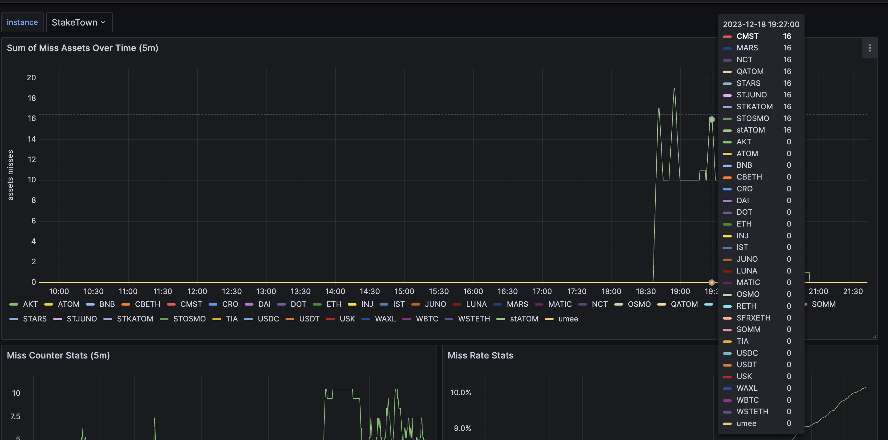
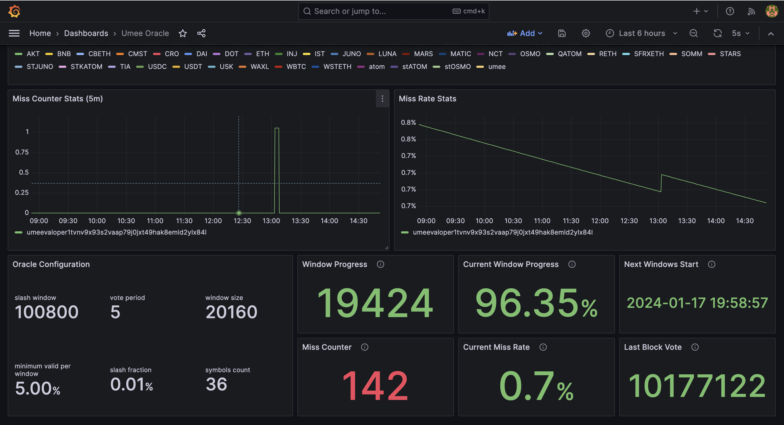

# Umee oracle monitoring
This monitoring stack for umee network.

## Prerequisites
We recommend to deploy monitoring stack on different machine, it requires low server resources,
so any small VPS will be enough.

Used ports:
- `8080` (alertmanager-bot)
- `9090` (prometheus)
- `9093` (alertmanager)
- `9999` (grafana)

Dependencies installation
- Install git and curl on the server
```bash
sudo apt-get update && sudo apt-get install -y git curl
```
- Install docker as it's being needed to run monitoring stack
```bash
bash <(curl -s https://raw.githubusercontent.com/staketown/utils/main/docker-install.sh)
```
Check docker compose, output should be like this (ex. Docker Compose version v2.16.0)
```bash
docker compose version
```

## Install monitoring stack
- Clone repository with monitoring stack to the server and prepare .evn file
```bash
git clone https://github.com/staketown/oracle-monitoring.git oracle-monitoring
cp $HOME/oracle-monitoring/config/.env.example $HOME/oracle-monitoring/config/.env
```
- Update values in _.env_ file with your own
```bash
nano $HOME/oracle-monitoring/config/.env
```

| KEY            | VALUE                                                                                                                                                                                                          |
|----------------|----------------------------------------------------------------------------------------------------------------------------------------------------------------------------------------------------------------|
| TELEGRAM_ADMIN | Your user id you can get from [@userinfobot](https://t.me/userinfobot). The bot will only reply to messages sent from the user. All other messages are dropped and logged on the bot's console                 |
| TELEGRAM_TOKEN | Your telegram bot access token you can get from [@botfather](https://telegram.me/botfather). To generate new token just follow a few simple steps described [here](https://core.telegram.org/bots#6-botfather) |
| UMEE_GRPC      | Your umee's grpc endpoint                                                                                                                                                                                      |

- Export **.env** file values into **.bash_profile**
```bash
echo "export $(xargs < $HOME/oracle-monitoring/config/.env)" >> $HOME/.bash_profile
source $HOME/.bash_profile
```

- Install yq to perform next action
```bash
sudo wget -qO /usr/local/bin/yq https://github.com/mikefarah/yq/releases/latest/download/yq_linux_amd64
sudo chmod a+x /usr/local/bin/yq
```

- Replce **YOUR_VALOPER_ADDRESS** with you validator address value and execute command
```bash
VALOPER=YOUR_VALOPER_ADDRESS yq -i '.scrape_configs[1].static_configs[0].labels.valoper = strenv(VALOPER)' ~/oracle-monitoring/prometheus/prometheus.yml
MONIKER=YOUR_VALOPER_MONIKER yq -i '.scrape_configs[1].static_configs[0].labels.instance = strenv(MONIKER)' ~/oracle-monitoring/prometheus/prometheus.yml
```

### Support several validators

Dashboard supports monitoring of several validators, to do that you just need
to open from working directory ```./prometheus/prometheus.yml``` and set one more config entity.
It should be looked like below:


## Start monitoring

- Deploy the monitoring stack
```bash
cd $HOME/oracle-monitoring && docker compose up -d
```

## Dashboard content
Grafana dashboard has static oracle on-chain configuration and dynamic 
those are being retrieved and calculated over exporter  




## Cleanup all container data
```bash
cd $HOME/oracle-monitoring && docker compose down && docker volume prune -f
```

## Reference list
- Some logic taken from [umee oracle exporter by P-OPSTeam](https://github.com/P-OPSTeam/umee-oracle-exporter)
- Stack of monitoring tools [node_tooling by Xiphiar](https://github.com/Xiphiar/node_tooling/)
- Alert manager telegram bot [alertmanager-bot by metalmatze](https://github.com/metalmatze/alertmanager-bot)

## Contribution
Just submit PR if you see any issues, we would appreciate it!