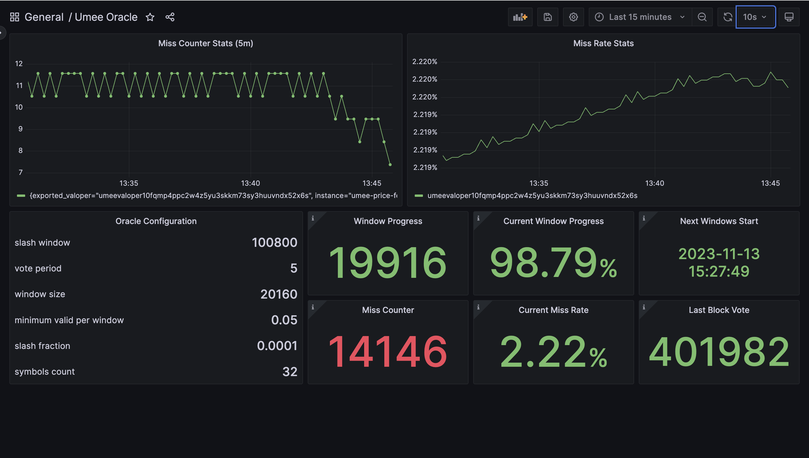

# Umee oracle monitoring

## Prerequisites
We recommend to deploy monitoring stack on different machine,
it requires small resources (Ubuntu 22.04 / 1 VCPU / 2 GB RAM / 20 GB SSD)

## Installation
1. Install git and curl
```
sudo apt-get update && sudo apt-get install -y git curl
```

2. Install docker as it's being needed to run monitoring stack
```bash
bash <(curl -s https://raw.githubusercontent.com/staketown/utils/main/docker-install.sh)
```
Check docker compose, output should be like this (Docker Compose version v2.16.0)
```bash
docker compose version
```

## Deployment

### Install monitoring stack
```
git clone https://github.com/staketown/oracle-exporter.git oracle-exporter
cp $HOME/oracle-exporter/config/.env.example $HOME/oracle-exporter/config/.env
```

### Update values in _.env_ file
```
nano $HOME/oracle-exporter/config/.env
```

| KEY            | VALUE                                                                                                                                                                                                          |
|----------------|----------------------------------------------------------------------------------------------------------------------------------------------------------------------------------------------------------------|
| TELEGRAM_ADMIN | Your user id you can get from [@userinfobot](https://t.me/userinfobot). The bot will only reply to messages sent from the user. All other messages are dropped and logged on the bot's console                 |
| TELEGRAM_TOKEN | Your telegram bot access token you can get from [@botfather](https://telegram.me/botfather). To generate new token just follow a few simple steps described [here](https://core.telegram.org/bots#6-botfather) |
| UMEE_GRPC      | Your umee's grpc endpoint                                                                                                                                                                                      |

### Export _.env_ file values into _.bash_profile_
```
echo "export $(xargs < $HOME/oracle-exporter/config/.env)" > $HOME/.bash_profile
source $HOME/.bash_profile
```

### Add validator into _prometheus_ configuration file
To add validator use command with specified
```bash
VALOPER=YOUR_VALOPER_ADDRESS && \
yq -i -y --arg val "$VALOPER" '.scrape_configs[1].static_configs[0].labels.valoper = $val' ./prometheus/prometheus.yml
```

To add more validators just run command above with validator values

### Run docker-compose
Deploy the monitoring stack
```
cd $HOME/oracle-exporter && docker-compose up -d
```

ports used:
- `8080` (alertmanager-bot)
- `9090` (prometheus)
- `9093` (alertmanager)
- `9999` (grafana)

## Dashboard contents
Grafana dashboard has static oracle on-chain configuration and dynamic 
those are being retrieved and calculated over exporter  



## Cleanup all container data
```bash
cd $HOME/oracle-exporter && docker-compose down && docker volume prune -f
```

## Reference list
Resources I used in this project:
- Stack of monitoring tools [node_tooling by Xiphiar](https://github.com/Xiphiar/node_tooling/)
- Alertmanager telegram bot [alertmanager-bot by metalmatze](https://github.com/metalmatze/alertmanager-bot)

## Contribution

Just submit PR if you see any issues, we would appreciate it!